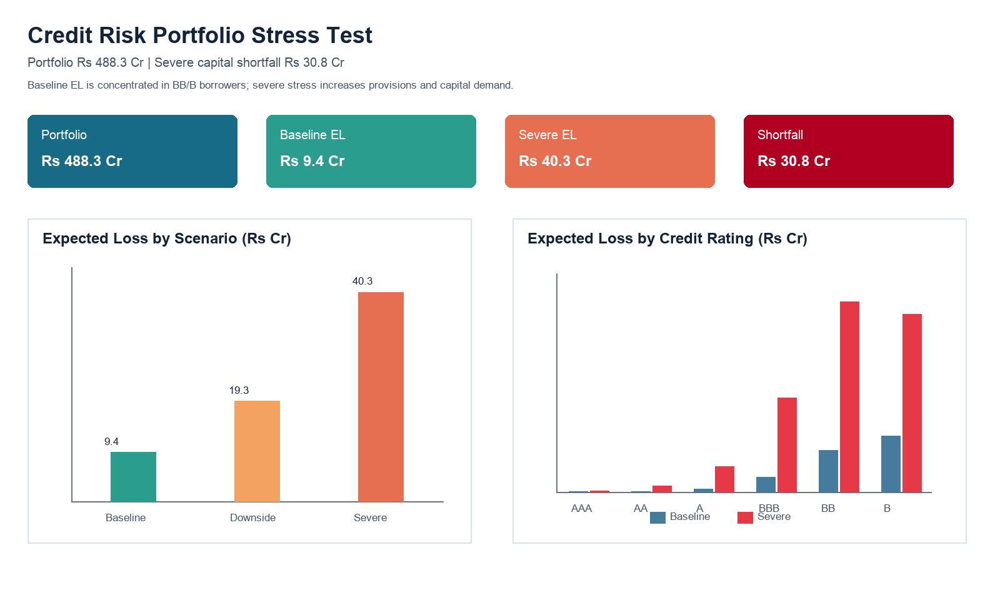

# Credit Risk Portfolio Stress Testing

Simulated a Rs 488.3 Cr loan portfolio, modelled PD/LGD/EAD across 6 credit grades, stress-tested 3 macro scenarios, and identified a Rs 30.8 Cr capital shortfall under the severe case.



## Management Summary

- Portfolio exposure is Rs 488.3 Cr across 10,000 loans in Retail, MSME, Corporate, Real Estate and Agri segments.
- Baseline expected loss is Rs 9.4 Cr, equal to 1.93% of EAD.
- Severe stress expected loss rises to Rs 40.3 Cr, a 4.3x uplift from baseline.
- Incremental capital shortfall under severe stress is Rs 30.8 Cr before management action.
- 1,010 loans are flagged for downgrade watchlist based on weak ratings, high LTV and repayment pressure.

## What This Project Does

This is a compact credit risk analyst proof-of-work. It uses the supplied LendingClub credit-risk repository as source context and recovery benchmark, then creates a controlled Rs 500 Cr-style portfolio so the full PD/LGD/EAD and stress-testing workflow is reproducible without private bank data.

The model answers:

- Probability of default: rating-level PD by AAA to B grade.
- Loss severity: LGD by rating and EAD by outstanding exposure.
- Expected loss: `PD x LGD x EAD` at account and portfolio level.
- Stress loss: baseline, downside and severe macro scenarios.
- Risk concentration: expected loss by rating, sector and watchlist loans.

## Streamlit App

This repo includes an interactive Streamlit dashboard in [app.py](app.py).

Run locally:

```bash
python -m pip install -r requirements.txt
streamlit run app.py
```

The app shows:

- Portfolio exposure and expected-loss KPI cards.
- Baseline, downside and severe stress loss comparison.
- Baseline vs severe expected loss by credit rating.
- Sector concentration table.
- Top 100 watchlist loans.

## Data Sources Used

- `Credit_Risk_Model_LoanDefaults-main/loan_data_defaults.csv`: real LendingClub charged-off loans used to benchmark empirical recovery and CCF by grade.
- `Credit_Risk_Model_LoanDefaults-main/df_scorecard.csv`: existing scorecard artifact reviewed for rating/feature context.
- `Power-BI-main/*.xlsx`: dashboard/tutorial reference files reviewed; not used as credit data because they are not loan-risk datasets.
- Synthetic portfolio: generated with fixed random seed for a controlled 10,000-loan book and repeatable dashboard outputs.

## Project Structure

```text
.
  app.py
  README.md
  render.yaml
  requirements.txt
  src/credit_risk_portfolio.py
  tests/test_credit_risk_portfolio.py
  notebooks/Credit_Risk_Portfolio_Model.ipynb
  outputs/credit_risk_powerbi_dataset.xlsx
  outputs/credit_risk_portfolio.csv
  outputs/scenario_stress_results.csv
  outputs/dashboard_preview.png
```

## How To Run

```bash
python -m pip install -r requirements.txt
python src/credit_risk_portfolio.py
python -m unittest discover -s tests
streamlit run app.py
```

## Deploy

### Streamlit Community Cloud

1. Push this repository to GitHub.
2. Go to Streamlit Community Cloud and create a new app.
3. Select this repo, branch `main`, and app file `app.py`.
4. Deploy.

### Render

This repository includes `render.yaml`, so Render can deploy it as a Python web service.

Build command:

```bash
pip install -r requirements.txt
```

Start command:

```bash
streamlit run app.py --server.port $PORT --server.address 0.0.0.0
```

## Power BI Build

Open `outputs/credit_risk_powerbi_dataset.xlsx` in Power BI and load these sheets:

- `Management_Summary` for KPI cards.
- `Excel_Dashboard` for a quick native Excel preview with charts.
- `Scenario_Stress` for baseline, downside and severe expected-loss comparison.
- `Rating_Summary` for expected loss by credit grade.
- `Sector_Rating_Matrix` for heatmap by sector and rating.
- `Portfolio` for slicers such as sector, rating and tenure.
- `Watchlist_Top100` for high-risk loan drill-down.

Recommended visuals:

- KPI cards: Total Portfolio, Baseline EL, EL %, Severe Capital Shortfall.
- Clustered bar: Baseline vs Downside vs Severe Expected Loss.
- Stacked bar: Baseline and Severe EL by credit rating.
- Matrix heatmap: Sector x Credit Rating expected loss.
- Table: Top 100 watchlist loans with LTV, DTI, PD, LGD and Severe EL.

## Key Assumptions

| Rating | Baseline PD | Severe PD | LGD |
|---|---:|---:|---:|
| AAA | 0.10% | 1.00% | 20% |
| AA | 0.20% | 2.50% | 25% |
| A | 0.70% | 6.00% | 35% |
| BBB | 2.20% | 14.00% | 45% |
| BB | 6.30% | 29.00% | 55% |
| B | 15.20% | 48.00% | 65% |

## Resume Bullet

Built an end-to-end credit risk stress-testing model for a Rs 488 Cr simulated loan book, calculating PD/LGD/EAD expected loss across 10K loans and identifying a Rs 30.8 Cr severe-stress capital shortfall with Power BI-ready outputs.
